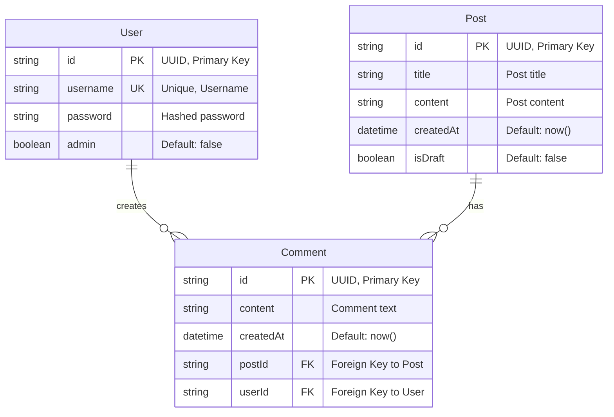
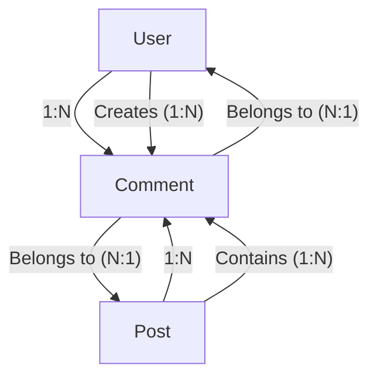

# Blog API Data Model Documentation

## Overview

The Blog API uses a PostgreSQL database with Prisma ORM to manage three core entities: Users, Posts, and Comments. The data model implements a clean relational structure that supports user authentication, content management, and community engagement features.

## Database Configuration

- **Database Provider**: PostgreSQL
- **ORM**: Prisma Client
- **ID Strategy**: UUID v4 for all primary keys
- **Timestamp Strategy**: ISO 8601 DateTime with timezone

## Entity Relationship Diagram



## Data Models

### User Model

The User model represents registered users of the blog platform with authentication and authorization capabilities.

#### Fields

| Field      | Type      | Constraints            | Description                                  |
| ---------- | --------- | ---------------------- | -------------------------------------------- |
| `id`       | `String`  | `@id @default(uuid())` | Primary key, auto-generated UUID             |
| `username` | `String`  | `@unique`              | Unique username for login and identification |
| `password` | `String`  | Required               | Hashed password using bcrypt                 |
| `admin`    | `Boolean` | `@default(false)`      | Role flag for administrative privileges      |

#### Relationships

- **One-to-Many with Comment**: A user can create multiple comments
  - Relation field: `Comment[]`
  - Access pattern: `user.Comment` returns all comments by the user

#### Business Rules

- **Username Uniqueness**: Each username must be unique across the platform
- **Password Security**: Passwords are hashed using bcrypt with configurable salt rounds
- **Admin Privileges**: Only admin users can create, edit, or delete posts and manage comments
- **Default Role**: New users are created as regular users (admin: false)

---

### Post Model

The Post model represents blog articles with support for draft and published states.

#### Fields

| Field       | Type       | Constraints            | Description                           |
| ----------- | ---------- | ---------------------- | ------------------------------------- |
| `id`        | `String`   | `@id @default(uuid())` | Primary key, auto-generated UUID      |
| `title`     | `String`   | Required               | Post title/headline                   |
| `content`   | `String`   | Required               | Full post content (supports markdown) |
| `createdAt` | `DateTime` | `@default(now())`      | Timestamp when post was created       |
| `isDraft`   | `Boolean`  | `@default(false)`      | Publication status flag               |

#### Relationships

- **One-to-Many with Comment**: A post can have multiple comments
  - Relation field: `Comment[]`
  - Access pattern: `post.Comment` returns all comments on the post

#### Business Rules

- **Draft System**: Posts can be saved as drafts (`isDraft: true`) and published later
- **Visibility**: Only published posts (`isDraft: false`) are visible to regular users
- **Admin Access**: Admin users can view and manage both drafts and published posts
- **Immutable Creation Time**: `createdAt` is set once and never modified

---

### Comment Model

The Comment model represents user feedback and discussions on blog posts.

#### Fields

| Field       | Type       | Constraints            | Description                                 |
| ----------- | ---------- | ---------------------- | ------------------------------------------- |
| `id`        | `String`   | `@id @default(uuid())` | Primary key, auto-generated UUID            |
| `content`   | `String`   | Required               | Comment text content                        |
| `createdAt` | `DateTime` | `@default(now())`      | Timestamp when comment was created          |
| `postId`    | `String`   | Foreign Key            | Reference to the post being commented on    |
| `userId`    | `String`   | Foreign Key            | Reference to the user who wrote the comment |

#### Relationships

- **Many-to-One with Post**: Multiple comments belong to one post
  - Relation field: `post`
  - Foreign key: `postId`
  - Reference: `Post.id`
  - Access pattern: `comment.post` returns the associated post

- **Many-to-One with User**: Multiple comments belong to one user
  - Relation field: `user`
  - Foreign key: `userId`
  - Reference: `User.id`
  - Access pattern: `comment.user` returns the comment author

#### Business Rules

- **Required Associations**: Every comment must be associated with both a post and a user
- **Referential Integrity**: Comments are automatically deleted if the associated post or user is deleted
- **Creation Permissions**: Any authenticated user can create comments
- **Management Permissions**: Only admin users can edit or delete comments

## Database Relationships

### Relationship Summary



### Relationship Details

#### User ↔ Comment (One-to-Many)

- **Cardinality**: One User can have many Comments
- **Foreign Key**: `Comment.userId` → `User.id`
- **Cascade Behavior**: When a user is deleted, all their comments are deleted
- **Access Patterns**:
  - Get all comments by a user: `user.Comment`
  - Get comment author: `comment.user`

#### Post ↔ Comment (One-to-Many)

- **Cardinality**: One Post can have many Comments
- **Foreign Key**: `Comment.postId` → `Post.id`
- **Cascade Behavior**: When a post is deleted, all its comments are deleted
- **Access Patterns**:
  - Get all comments on a post: `post.Comment`
  - Get the post a comment belongs to: `comment.post`

## Data Access Patterns

### Common Query Patterns

#### 1. Get Published Posts with Comment Count

```javascript
const posts = await db.post.findMany({
  where: { isDraft: false },
  include: {
    _count: {
      select: { Comment: true },
    },
  },
  orderBy: { createdAt: 'desc' },
})
```

#### 2. Get Post with All Comments and Authors

```javascript
const postWithComments = await db.post.findUnique({
  where: { id: postId },
  include: {
    Comment: {
      include: {
        user: {
          select: { id: true, username: true },
        },
      },
      orderBy: { createdAt: 'asc' },
    },
  },
})
```

#### 3. Get User with Their Comments and Associated Posts

```javascript
const userWithActivity = await db.user.findUnique({
  where: { id: userId },
  include: {
    Comment: {
      include: {
        post: {
          select: { id: true, title: true },
        },
      },
    },
  },
})
```

## Indexing Strategy

### Recommended Indexes

1. **User.username** - Unique index (automatically created)
2. **Comment.postId** - Foreign key index for efficient post → comments queries
3. **Comment.userId** - Foreign key index for efficient user → comments queries
4. **Post.createdAt** - For chronological sorting of posts
5. **Comment.createdAt** - For chronological sorting of comments
6. **Post.isDraft** - For filtering published vs draft posts

### Performance Considerations

- **UUID Performance**: UUIDs provide excellent uniqueness but may have slight performance impact compared to sequential integers
- **Foreign Key Indexes**: Prisma automatically creates indexes on foreign key fields
- **Composite Queries**: Consider compound indexes for frequently combined filter conditions

## Security Considerations

### Data Protection

1. **Password Hashing**: User passwords are never stored in plain text
2. **Admin Privileges**: Sensitive operations are restricted to admin users
3. **Input Validation**: All user inputs are validated using Zod schemas
4. **SQL Injection Protection**: Prisma provides automatic protection against SQL injection

### Access Control

- **Authentication Required**: Comment creation requires valid JWT token
- **Role-Based Access**: Admin-only operations are enforced at the middleware level
- **Data Visibility**: Draft posts are hidden from non-admin users

## Migration Strategy

### Schema Evolution

The database schema is managed through Prisma migrations:

```bash
# Create a new migration
npx prisma migrate dev --name "descriptive_migration_name"

# Apply migrations to production
npx prisma migrate deploy

# Reset development database
npx prisma migrate reset
```

### Backup Considerations

1. **Regular Backups**: Implement automated daily backups
2. **Migration Testing**: Test all migrations on staging environment first
3. **Rollback Strategy**: Maintain rollback procedures for failed migrations

---

_This documentation reflects the current database schema as of the latest migration. Always verify against the actual `schema.prisma` file for the most up-to-date information._
